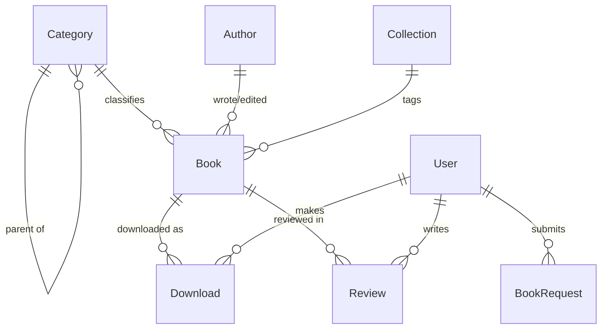

# Domain model — downloadsachyhoc-com

EVIDENCE BASIS — downloadsachyhoc-com — 2026-09-16
Features:  49   observed 19 (39%) · inferred 27 (55%) · guessed 3 (6%)   ·  ratio 1.6:1
Blocked:   WP REST API disabled · no SPA/i18n bundle · AUTHENTICATED MEMBER AREA NOT CAPTURED
Ceiling:   All logged-in member behavior (account, downloads, checkout/payment, upgrade,
           book-request, courses, review submission) is INFERRED ONLY. Per-book tier gating
           and PDF delivery inferred/guessed. Payment method UNKNOWN. Public catalog,
           book detail, pricing page, auth modal and support widgets are observed.

---

> **Scope note.** The paragraphs below marked *(reference)* describe the site we reverse-engineered.
> **Our build is simpler** — see "Our build's domain" first. The reference's tier/membership/payment
> machinery (Plan, Membership, Order, CourseGrant, Promotion, `Book.min_tier`, Google identity) is
> **OUT OF SCOPE** and retained here only as reconnaissance.

## Our build's domain (what gets built)

A **catalog + free-download library behind a simple login**. The corpus is a **Book** set (~1,085)
organized by a hierarchical specialty **Category** tree and an **Author** attribute, with
merchandising **Collection** tags. Anyone browses it. To **download**, a **User** logs in with a
**username + password** (no social login, no tiers) — and a logged-in user may download **any**
book. Each download writes a **Download** row, which powers the user's **My library** (re-download
history — Bet 2). *Later* satellites: **BookRequest**, **Review**, **Post** (blog), **Course**.

The single most important design object is no longer an access ladder — it is the **binary access
rule**: *browse is public; download requires login; login grants everything.* Get that plus the
catalog IA right and the product is complete.

## Shape of the reference domain *(reference — OUT OF SCOPE below the access rule)*

The reference was a **content-entitlement store**: the money model was not per-book sales but a
**Membership** to one of four **Plans** unlocking **Download** access via an ordered access ladder
(each Book carried a `min_tier`: `free < thuong < vip < gold < diamond`). A Membership granted a
Plan; a Plan enumerated which `min_tier` levels it unlocked; a Download was permitted iff the user's
active Plan covered the Book's `min_tier`. Satellite lines: **Course** (video, sold/bonused) and
**BookRequest** (a tier perk). **Our build drops this entire tier/payment half** and replaces it
with the binary rule above.

## ERD — our build (in scope)

No tier, membership, order or payment entity — a logged-in `User` downloads any `Book`, and each
download is a `Download` row (the library). `Review`, `BookRequest`, `Post`, `Course` are *Later*.

### Reference ERD (OUT OF SCOPE — reconnaissance only)

The reference additionally had `User ||--|| Membership`, `User ||--o{ Order`, `Plan ||--o{
Membership`, `Plan ||--o{ Book "unlocks by min_tier"`, `Order ||--o{ Membership "activates"`,
`Order ||--o{ Course`, `Course ||--o{ CourseGrant`, `Promotion ||--o{ Plan`, and a Google identity
on `User`. All dropped.

## Entities (roles in brief)

**In scope (our build):**
- **Book** — the catalog unit. `language` (vi/en/translated) and `year` are display/filter facets
  only (no tier perk). No `min_tier` — download is login-gated, not tier-gated.
- **Category** — self-referential 3-level specialty tree (12 top-level, 79 total). The IA spine.
- **Author** — 666 attribute terms; a browse axis, not a rich profile.
- **Collection** — merchandising tags ("sách hay", "tải nhiều") powering the homepage/sidebar rails.
- **User** — an account with **username + password** (no social identity). `role` is
  visitor | member | admin — "member" is simply any logged-in account (no tiers).
- **Download** — a download event; powers **My library** (re-download) and `download_count` →
  "most downloaded".
- **BookRequest** *(Later)* — logged-in user's request for a missing title (no tier gating).
- **Review** *(Later)* — star rating + comment; display observed, submission inferred (WP moderation).
- **Post** *(Later)* — blog / static content (SEO, guides).
- **Course** *(Later)* — secondary video-course line; count and player UNKNOWN.

**Out of scope (reference only — no tiers, no payment, no social login):**
- ~~**Plan**~~ — 4 tier definitions (price, duration, access levels, quotas, no-ads).
- ~~**Membership**~~ — a user's live tier entitlement (status, expiry).
- ~~**Order**~~ — WooCommerce purchase of a Plan/Course; `payment_method` UNKNOWN.
- ~~**CourseGrant**~~ — bonus-course entitlement for GOLD/DIAMOND.
- ~~**Promotion**~~ — time-boxed discount campaign (marketing-page).
- ~~**User.google_id**~~ — Google OAuth link.

## Endpoint → (entity, action) mapping

| Endpoint (from endpoints.csv) | Entity.action |
|---|---|
| GET /sach/{slug}/ | Book.read |
| GET /danh-muc-sach/{cat}/ | Category.browse (→ Book.list) |
| GET (pa_tac-gia archive) | Author.browse (→ Book.list) |
| GET /thu-vien-sach/ | Book.list |
| GET /goi-tai-khoan/ | Plan.list — *OUT OF SCOPE (reference)* |
| GET /my-account/ | User.session (account home; no Membership) |
| POST admin-ajax (WOOF) | Book.filter |
| POST admin-ajax (quick-view/widgets) | Book.read (partial) |
| Tải sách → login → download | Download.request (login-gated only, no Order) |
| GET /search_gcse/ | Book.search |
| GET /tin-tuc/ , /{post} | Post.read |

Every recon endpoint maps to a single (entity, action). The reference's `/goi-tai-khoan/`
(Plan.list) and checkout endpoints map to out-of-scope entities and are not built.
