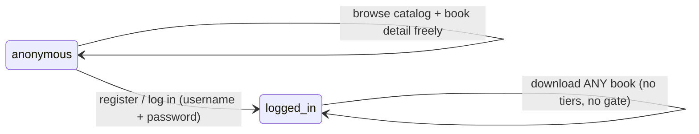
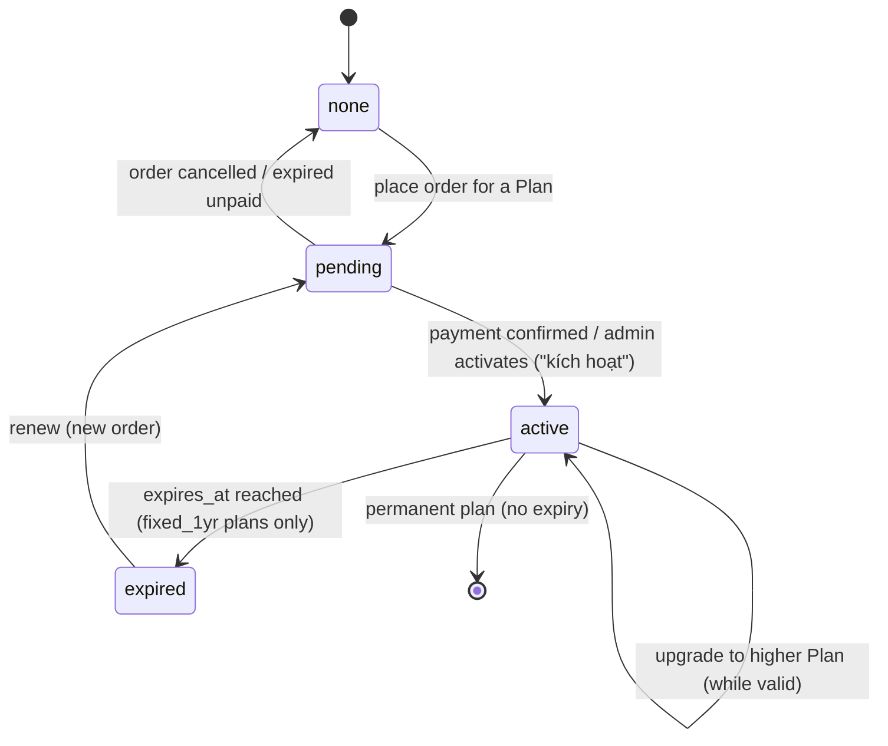
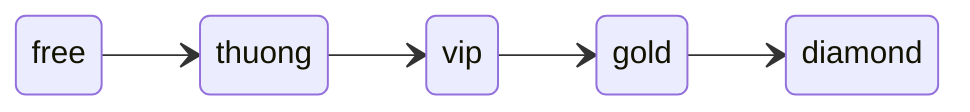
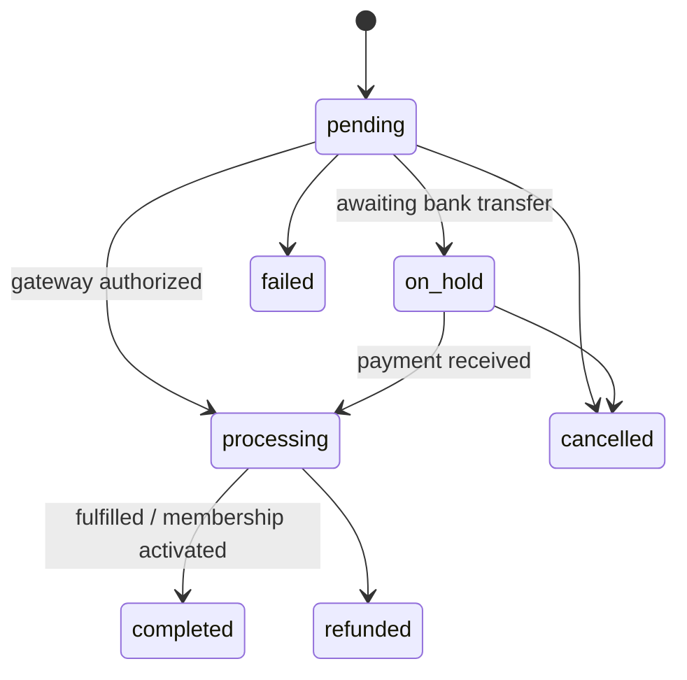
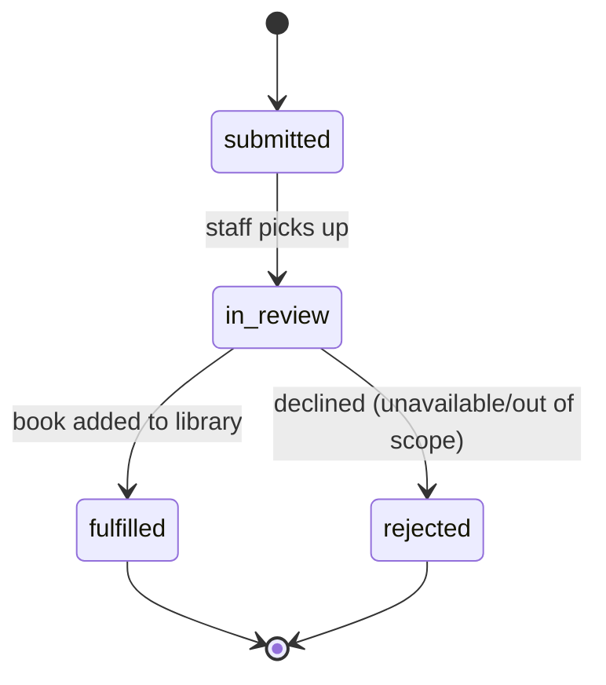
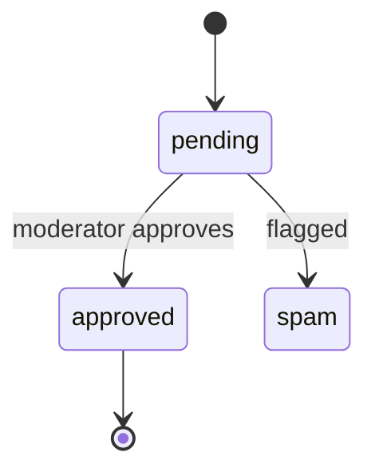

# State machines — downloadsachyhoc-com

All transitions below are **inferred** unless marked observed — the member/checkout area was not
exercised (session logged out). Enums come from the pricing page, WooCommerce defaults, and the
access-ladder logic. Unknown transitions are drawn as notes, not invented.

> **Scope note for our build.** Machines §1 (Membership.status), §2 (Book.min_tier) and §3
> (Order.status) document the **reference** and are **OUT OF SCOPE** — our build has **no tiers and
> no payment**. They are kept as reconnaissance, not as build specs. Our build replaces all three
> with the single **Access** rule in §0 below. §4 (BookRequest) and §5 (Review) survive as *Later*
> features.

## 0. Access  (OUR BUILD — the only access rule)

Binary access. Anyone may browse the whole catalog and every book-detail page. **Download requires
login and nothing more** — a logged-in account can download any book. There is no tier check, no
entitlement ladder, no purchase. This is the entire access model; everything below is reference-only.

## 1. Membership.status  (REFERENCE ONLY — OUT OF SCOPE, no tiers in our build)

| From | To | Trigger | Who | Side effects | Confidence |
|---|---|---|---|---|---|
| none | pending | buy a Plan | user | Order created; payment instructions shown | inferred |
| pending | active | payment confirmed | admin/gateway | access granted; expires_at set (or null if permanent); receipt email | inferred |
| pending | none | unpaid/cancelled | system/admin | order closed | inferred |
| active | active | upgrade | user | plan swapped; access levels widened; (pro-ration?) unknown | inferred (FAQ) |
| active | expired | reach expires_at | system | download gate closes; renewal reminder | inferred |
| expired | pending | renew | user | new order | inferred |

Note: DIAMOND/VIP/GOLD are described as "vĩnh viễn" (permanent) → no expiry; THƯỜNG is 1 year.

## 2. Book.min_tier  (REFERENCE ONLY — OUT OF SCOPE; our build has no per-book tier)

Ordered access levels. Download allowed iff user's active Plan.access_levels ⊇ Book.min_tier.
Surfaced to users as a "2nd note line" on the book info (per pricing FAQ). Confidence: inferred.
`free` books are downloadable after login without a paid plan (inferred).

## 3. Order.status  (REFERENCE ONLY — OUT OF SCOPE, no payment in our build)

| From | To | Trigger | Side effects | Confidence |
|---|---|---|---|---|
| pending | on_hold | choose bank transfer | show bank details; await manual confirm | inferred (likely method) |
| on_hold/processing | completed | payment verified | Membership → active; CourseGrants created | inferred |
| * | cancelled/failed | timeout/decline | no access | inferred |

Payment method UNKNOWN — `on_hold` (manual bank transfer + admin activation) is the assumed
default for this Vietnamese membership model but was **not observed**.

## 4. BookRequest.status

| From | To | Trigger | Who | Side effects | Confidence |
|---|---|---|---|---|---|
| — | submitted | member submits request (EN/VN per tier) | member | staff notified | inferred |
| submitted | in_review | staff triage | admin | — | inferred |
| in_review | fulfilled | book uploaded | admin | requester notified; book appears in catalog | inferred |
| in_review | rejected | not available | admin | requester notified | inferred |

## 5. Review.status  (WordPress comment moderation)

Display of ratings observed; submission + moderation inferred. Whether reviews are open to all
members or gated is unknown.

## Feed-back into features.csv

State-machine discoveries were added as inferred rows: `membership.renewal`, `notify.renewal-reminder`
(both **now `verdict=drop`** — they hang off Membership.status/Order.status, which are out of scope),
and `notify.transactional-email` (**narrowed** to account emails only — register confirmation,
password reset — since order/activation/expiry emails no longer exist).
