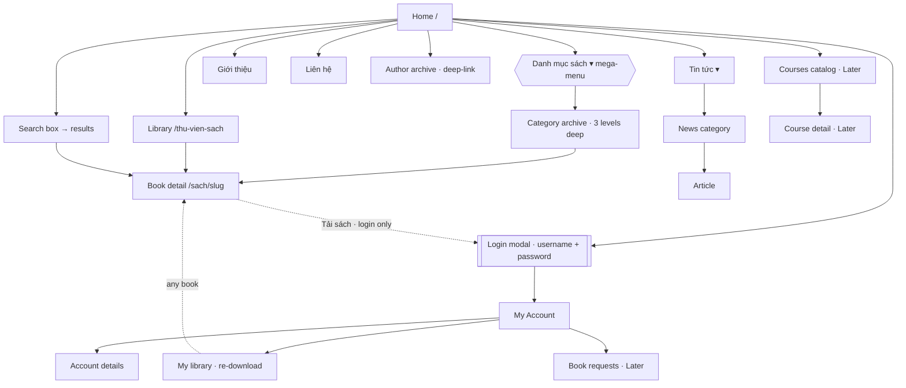

# Sitemap — downloadsachyhoc-com

24 screens across 6 layout patterns (marketing-page removed; **no tiers, no payment, no social
login**). The login modal is the single gate: browse is fully public, and **any logged-in account
can download any book** — no tier surfaces exist. Membership is arranged off-site.

## Navigation tree (as experienced)

## Primary nav (header)
Danh mục sách (mega-menu of 79 categories) · Tin tức · Liên hệ · Giới thiệu · Search box ·
Hướng dẫn tải sách · Đăng nhập / Đăng ký. (Gói tài khoản / Khuyến mãi removed with marketing-page;
no tier/upgrade entries.)

## Global chrome (on every screen)
Header (logo, 2 value-props, nav, search) · footer (about, quick links, socials) ·
Messenger chat widget (bottom-right) · live social-proof toast (bottom-left).

## Depth warning
- **Category → subcategory → sub-subcategory → book detail = depth 4.** The specialty tree has
  3 taxonomy levels (e.g. `can-lam-sang / chan-doan-hinh-anh / x-quang`). Books at the deepest
  branch are 4 clicks from home via the tree — mitigated by search, homepage rails, and the
  mega-menu jumping straight to any level. Flag for UX (step 05).
- **Author archives (666)** have no menu entry — reachable only from a book's author link or
  deep link. Effectively orphan browse axis (see orphan-routes.md).

## Modal-only surfaces
Login, Register, Quick-view — no dedicated URL; triggered site-wide. The login modal (username +
password) is the single gate between the public and member halves of the app; once through it, a
user can download anything.
