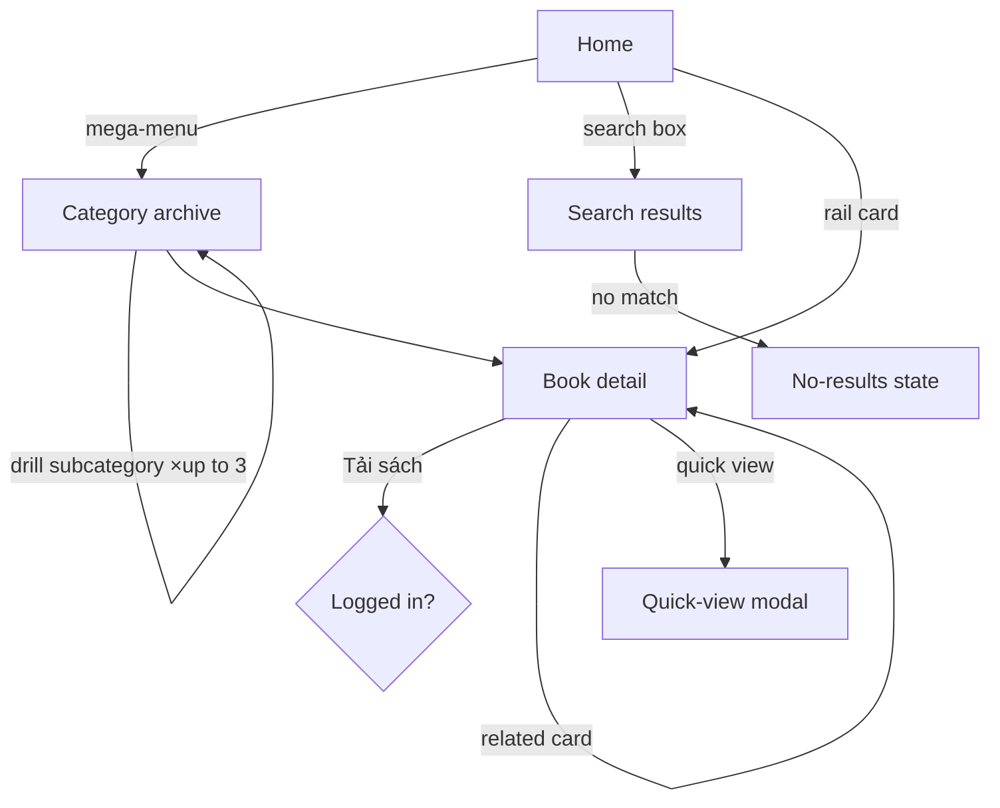

# Flow: Browse → Book detail (public, OBSERVED)

## Happy path
| # | Action | Screen | Result | Wait |
|---|---|---|---|---|
| 1 | Land on home | Home | Curated rails + mega-menu + search | cache, instant |
| 2 | Open "Danh mục sách" or type in search | Home | Mega-menu of 79 categories / search box | instant |
| 3 | Pick specialty (or search term) | Category / Search results | Grid of book cards (cover, title, editor, rating) | server render |
| 4 | Click a book | Book detail | Cover, editor, language, publisher, "Tải sách" CTA, description, related | server + ajax |
Steps: 4 · Screen changes: 3 · Fields: 0–1 (search) · Total wait: ~1–2s

## Branch map

## Branches
| # | Probe | Trigger | Observed behavior | Microcopy (verbatim) | Assessment |
|---|---|---|---|---|---|
| 1 | Deep link | open `/sach/{slug}` directly | Works, full page renders | — | good |
| 2 | AJAX widget | scroll to "Sách hay dành cho bạn" / "Sách tải nhiều" | **Load error while logged out** | "Lỗi tải nội dung." | OBSERVED bug/gate — recommendation rails fail for anonymous users |
| 3 | Nav depth | drill category tree | up to 3 taxonomy levels → book = **depth 4** | breadcrumb: Home / cận lâm sàng / chẩn đoán hình ảnh / X quang | findability risk |
| 4 | Related | click a "Sách cùng chuyên ngành" card | navigates to that book | "XEM NHANH" (quick view) | good cross-sell |
| 5 | Search diacritics | Vietnamese without tone marks | placeholder warns to use diacritics | "gõ tiếng việt có dấu" | friction — accent-sensitive |

## Unreached
| State / branch | Why |
|---|---|
| No-results copy | not triggered (would need a live search) |
| Quick-view modal contents | not exercised |

## Notes for the rebuild
Gets right: clean book-detail with the metadata a buyer needs; strong related-books cross-sell.
Gets wrong: recommendation rails break for anonymous visitors (dead "Lỗi tải nội dung" blocks);
search demands correct Vietnamese diacritics; deepest books sit 4 clicks down. Rebuild: make rails
degrade gracefully logged-out, add accent-insensitive search, and flatten access via facets/search.
