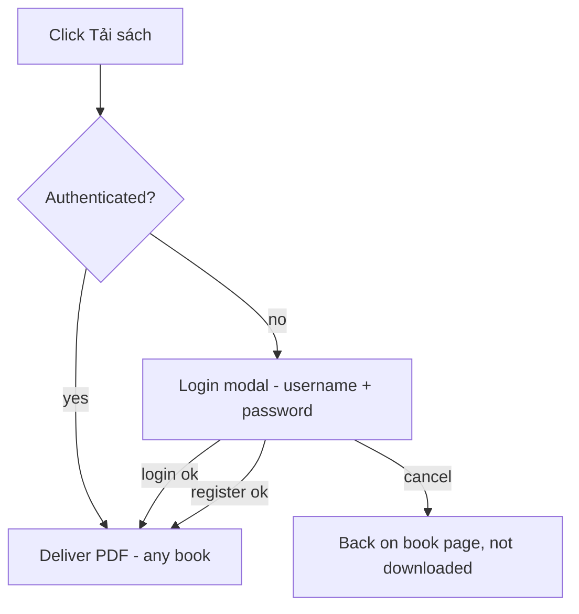

# Flow: Download a book / the login gate (partly OBSERVED)

**Our build has no tiers.** The gate is binary: logged in ⇒ the file downloads; logged out ⇒ a
login modal, then the download resumes. There is no entitlement check and no "upgrade" branch.
(The reference had a tier check at the same point — recorded below as reconnaissance, not built.)

## Happy path (our build)
| # | Action | Screen | Result | Wait |
|---|---|---|---|---|
| 1 | On a book page, click "Tải sách" | Book detail | if logged in → file downloads; else login modal opens over the page | instant |
| 2 | (if gated) log in or register — **username + password** | Login modal | authenticated, modal closes | ~1s |
| 3 | download resumes automatically | Book detail | **PDF delivered** | delivery time |
Steps: 1 (logged in) or 1 + auth · Screen changes: 0 (modal). No tier check anywhere.

## Branch map

## Branches
| # | Probe | Trigger | Behavior | Microcopy intent | Assessment |
|---|---|---|---|---|---|
| 1 | Permission (anon) | click Tải sách logged out | Login modal appears | "Log in to download" | OBSERVED (reference) — clean single gate |
| 2 | Auth options | inspect modal | username/email + password + register link (**no Google in our build**) | "No account? Register" | our build: username+password only |
| 3 | Delivery (logged in) | any logged-in user, any book | file delivered | — | **INFERRED — see BRIEF §3.2 (R1)** |
| 4 | Cancel gate | close the login modal | return to book page, no download, place kept | — | design decision |
| 5 | Protected delivery | after download | file URL / auth unknown | — | **GUESSED — R1: is the PDF leaky?** |
| 6 | Repeat download | same user, same book | downloads again + appears in My library | — | design decision (no cap; R7 abuse) |

## Unreached
| State / branch | Why |
|---|---|
| Successful delivery, file URL, "unlimited"/throttle semantics | Session logged out; deferred to BRIEF.md §3.2 (R1) |
| ~~tier-block UX~~ | **N/A — no tiers in our build** |

## Notes for the rebuild
Gets right: a single, consistent site-wide login gate on the money action, over the current page so
the user resumes the book. Our simplification: **the gate has only two outcomes** — download, or
log in then download. No not-entitled/upsell branch exists (that was the reference's tier note —
Differentiation Bet 2 is now "one honest rule, no dead clicks"). Still verify before shipping:
file-delivery security (R1) and whether repeat/bulk downloads need a throttle (R7). The login modal
must ask for **username + password only** — no Google button.
